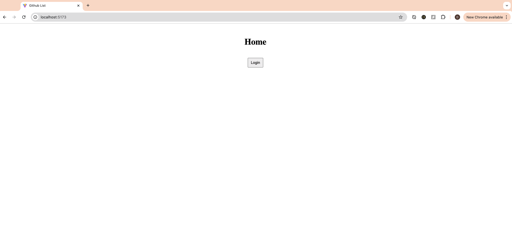
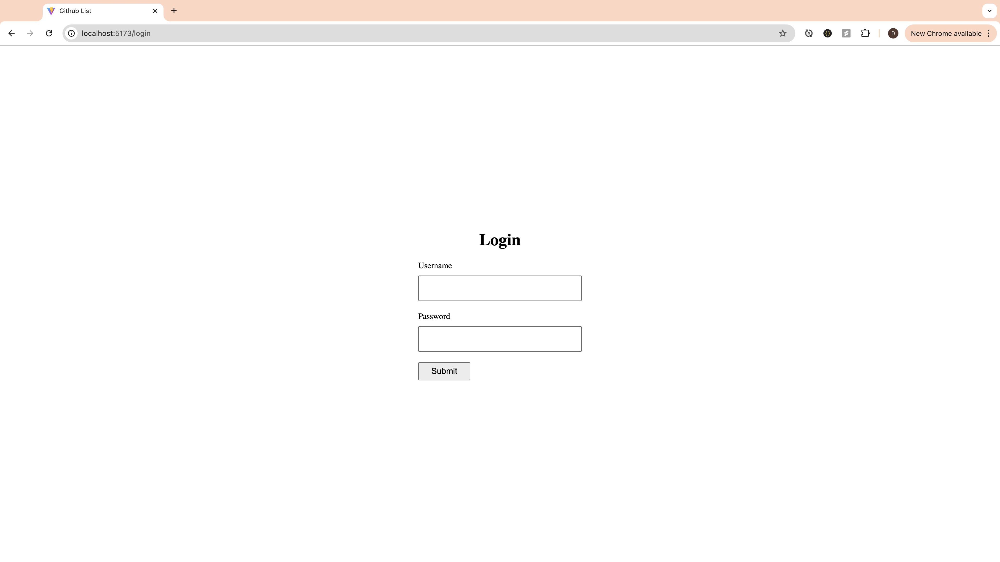
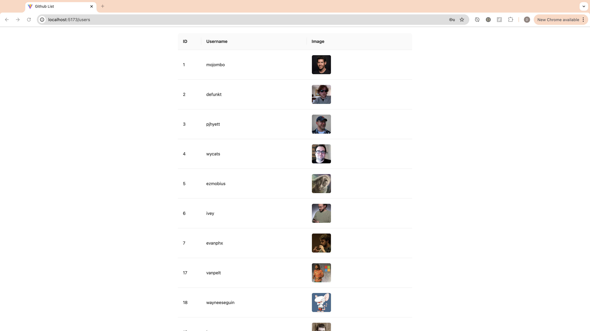
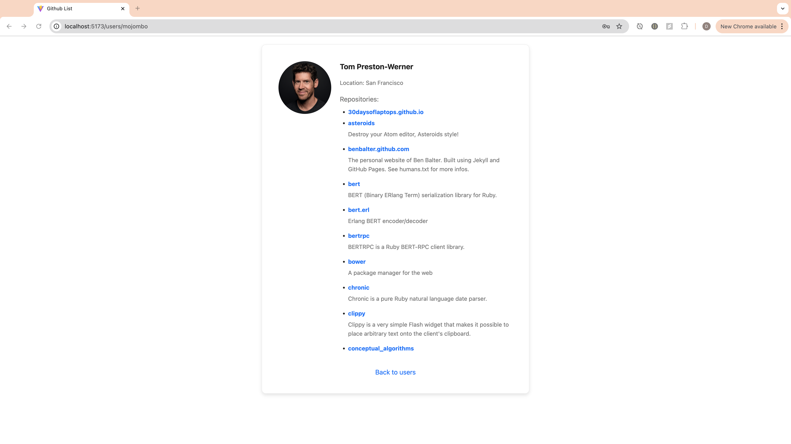
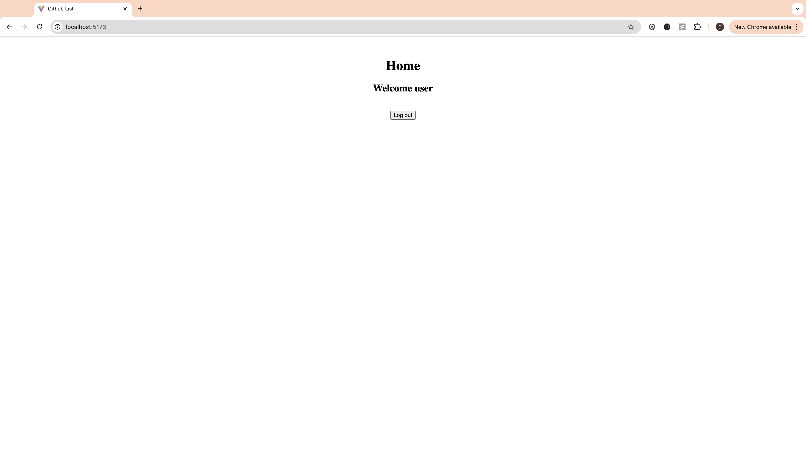

Refactor lecture 14 homework 1 to use React Router

## Requirements

- [ ] have at least 3 routes: `/login`, `/users`, `/users/:login`
- [ ] username and password are up to you
- [ ] `/users` and `/users/:login` should be protected by login. If the user is not logged in, redirect to `/login`, and once the user is logged in, redirect back to the original page.

## DEMO

### 1. Initial homepage

### 2. Access `/users` while not logged in, redirect to `/login`

### 3. Log in successfully with `username: user` and `password: password`, redirect back to the `/users` page

### 4. Click on any user and go to their profile page `/users/:login`. Also can go back to `/users` with the link below

### 5. Log out in the homepage `/`

